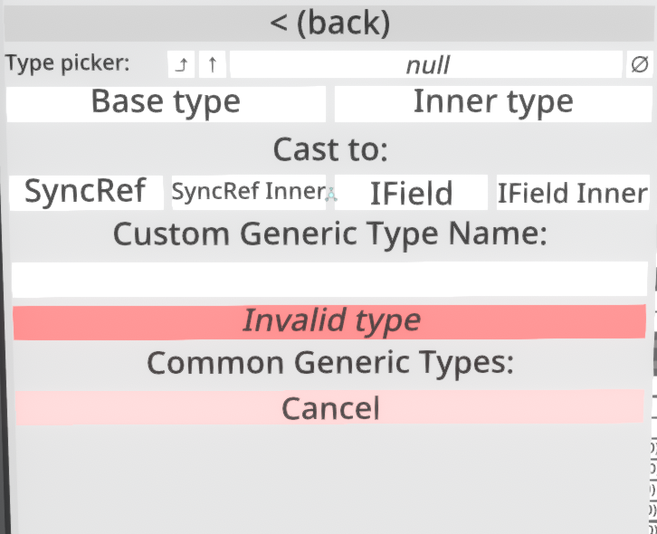

# Type Picker

A [ResoniteModLoader](https://github.com/resonite-modding-group/ResoniteModLoader) mod for [Resonite](https://resonite.com/) that adds type picker into ComponentAttacher 

Just drop any reference into the picker and choose the type

## Installation
1. Install [ResoniteModLoader](https://github.com/resonite-modding-group/ResoniteModLoader).
2. Place [TypePicker.dll](https://github.com/TheJebForge/TypePicker/releases/latest/download/TypePicker.dll) into your `rml_mods` folder. This folder should be at `C:\Program Files (x86)\Steam\steamapps\common\Resonite\rml_mods` for a default install. You can create it if it's missing, or if you launch the game once with ResoniteModLoader installed it will create the folder for you.
3. Start the game. If you want to verify that the mod is working you can check your Resonite logs.